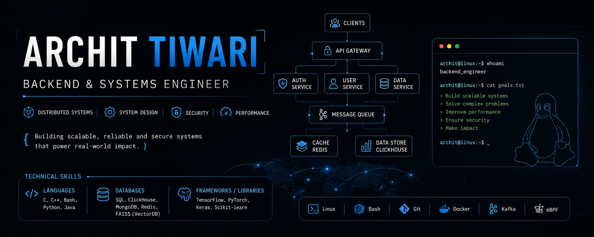

  

<h3 align="center">Specializing in scalable data platforms, AI-powered developer platforms, system-level architecture, and security pipelines.</h3>

  

## About Me

- Building **multi-modal biometric authentication systems** integrating fingerprint, iris, and facial recognition for secure and resilient voter authentication.

- Interested in building scalable backend systems, distributed infrastructure, and security-focused platforms.

- Open to collaborating on **open-source systems software, distributed infrastructure, and performance engineering projects.**

## Currently Learning

Diving deep into:

- Distributed Consensus (Raft & Paxos)
- Linux Kernel Internals
- eBPF for Network Observability

## Interests

- Distributed Systems
- Backend Engineering
- System Design
- Security Engineering
- Performance Engineering
- Real-time Data Processing

## Contact

- **Email:** architvnt@gmail.com

  

